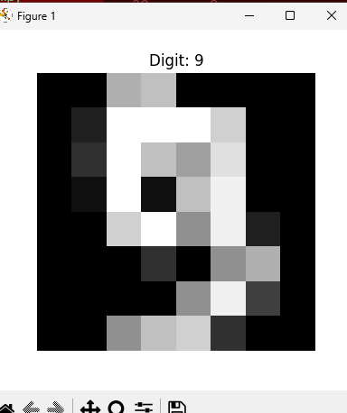
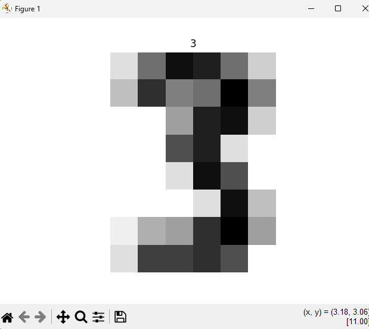

# Handwritten Digit Recognition using SVM

This project implements a Support Vector Machine (SVM) classifier on the Scikit-Learn Digits dataset to recognize handwritten digits.

## Dataset Visualization

## Prediction Result

## Model Accuracy

## Technologies Used

- Python
- NumPy
- Scikit-Learn
- Matplotlib

## Machine Learning Type

- Supervised Learning
- Classification
- Support Vector Machine (SVM)

## Accuracy

**99.11%**
